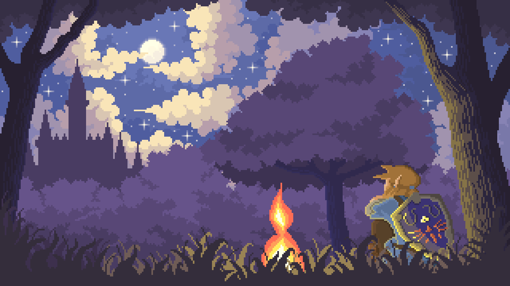

<link href="https://fonts.googleapis.com/css2?family=VT323&display=swap" rel="stylesheet">

I’m a CS student. Coding is life, building rand() cool stuff, and tweakin' the hell outta my code till it obeys its "lord" (me, btw). When I ain’t coding, I’m prolly out exploring Hyrule, cause I’m lowkey obsessed with The Legend of Zelda 🗡️. And if I ain’t doin’ either of those, I’m 100% huntin’ down chocolate or cake. 🍫Certified sugar addict fr.

